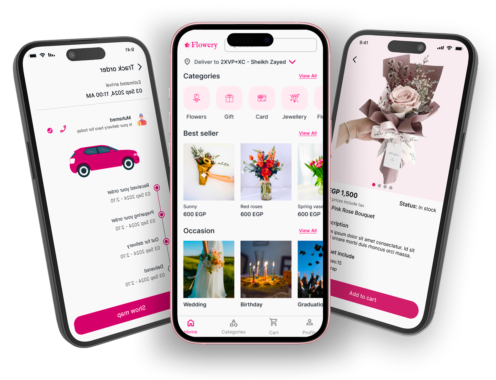

# 🌸 Flower App

A beautiful and feature-rich Flutter application designed for browsing, searching, and purchasing flowers. Built with **Clean Architecture** and **Flutter Bloc**, ensuring scalability, testability, and maintainability.

<p align="center">
  
  
  
  
</p>

---

## 📱 App Screenshots

| Onboarding | Login | Home | Product Details |
|:---:|:---:|:---:|:---:|
|  |  |  |  |

| Cart | Checkout | Profile | Notifications |
|:---:|:---:|:---:|:---:|
|  |  |  |  |


## ✨ Features

- **Authentication**: Secure User Login & Registration.
- **Home**: Browse featured collections and best-selling flowers.
- **Search**: Advanced search functionality to find specific flowers.
- **Best Seller**: Curated list of top-performing products.
- **Cart & Checkout**: Seamless shopping cart and checkout experience.
- **Notifications**: Real-time updates for orders and promotions.
- **Responsive UI**: Optimized for various screen sizes using `flutter_screenutil`.
- **Offline Support**: Caching and local storage handling.

---

## 🛠 Tech Stack & Libraries

This project uses a robust set of libraries and tools to ensure high performance and code quality.

### **Core**
- **[Flutter](https://flutter.dev/)**: Google's UI toolkit for building natively compiled applications.
- **[Dart](https://dart.dev/)**: The programming language used.

### **Architecture & State Management**
- **Clean Architecture**: Separated into `Presentation`, `Domain`, `Data`, and `API` layers.
- **[Flutter Bloc](https://pub.dev/packages/flutter_bloc)**: Predictable state management.
- **[GetIt](https://pub.dev/packages/get_it)** & **[Injectable](https://pub.dev/packages/injectable)**: For Dependency Injection (DI).

### **Networking & APIs**
- **[Dio](https://pub.dev/packages/dio)**: Powerful HTTP client for Dart.
- **[Retrofit](https://pub.dev/packages/retrofit)**: Type-safe REST client generator.
- **[Pretty Dio Logger](https://pub.dev/packages/pretty_dio_logger)**: Network logging for debugging.
- **[Connectivity Plus](https://pub.dev/packages/connectivity_plus)**: Network connectivity status.

### **Local Storage**
- **[Shared Preferences](https://pub.dev/packages/shared_preferences)**: Simple key-value storage.
- **[Flutter Secure Storage](https://pub.dev/packages/flutter_secure_storage)**: Secure storage for sensitive data like tokens.

### **UI & UX**
- **[Flutter ScreenUtil](https://pub.dev/packages/flutter_screenutil)**: Screen adaptation and font scaling.
- **[Google Fonts](https://pub.dev/packages/google_fonts)**: Custom typography.
- **[Flutter SVG](https://pub.dev/packages/flutter_svg)**: SVG rendering support.
- **[Skeletonizer](https://pub.dev/packages/skeletonizer)**: Skeleton loading effects.
- **[Carousel Slider](https://pub.dev/packages/carousel_slider)**: Image carousels.
- **[Animated Text Kit](https://pub.dev/packages/animated_text_kit)**: Text animations.
- **[Auto Size Text](https://pub.dev/packages/auto_size_text)**: Text that automatically resizes to fit bounds.

### **Utilities**
- **[Dartz](https://pub.dev/packages/dartz)**: Functional programming concepts (Either, Option).
- **[Intl](https://pub.dev/packages/intl)**: Internationalization and localization.
- **[Logger](https://pub.dev/packages/logger)**: Pretty console logging.
- **[Image Picker](https://pub.dev/packages/image_picker)**: Selecting images from gallery or camera.
- **[Json Annotation](https://pub.dev/packages/json_annotation)**: JSON serialization boilerplate.

---

## 🚀 Installation & Getting Started

### Prerequisites
- [Flutter SDK](https://flutter.dev/docs/get-started/install)
- [Dart SDK](https://dart.dev/get-dart)
- An IDE (VS Code, Android Studio)

### Steps

1. **Clone the Repository**
   ```bash
   git clone https://github.com/lbarsidati22/flower_app.git
   cd flower_app
   ```

2. **Install Dependencies**
   ```bash
   flutter pub get
   ```

3. **Generate Code (if needed)**
   Since this project uses `json_serializable`, `retrofit`, and `injectable`, you might need to run the build runner.
   ```bash
   dart run build_runner build --delete-conflicting-outputs
   ```

4. **Run the App**
   ```bash
   flutter run
   ```

---

## 📂 Project Structure

```
lib/
├── core/                   # Core utilities, constants, errors, network clients
├── gen/                    # Generated files (assets, etc.)
├── project_layers/         # Feature-based layers
│   ├── api_layer/          # Remote data sources & API configurations
│   ├── data_layer/         # Repositories implementations & Models
│   ├── domain_layer/       # Entities, Use Cases, & App Logic
│   └── presentaion_layer/  # UI, Widgets, & BLoCs
└── main.dart               # App entry point
```

---

## 🤝 Contributing

Contributions are welcome! Please follow these steps:

1. Fork the project.
2. Create your feature branch (`git checkout -b feature/AmazingFeature`).
3. Commit your changes (`git commit -m 'Add some AmazingFeature'`).
4. Push to the branch (`git push origin feature/AmazingFeature`).
5. Open a Pull Request.

---

## 📄 License

This project is licensed under the MIT License - see the [LICENSE](LICENSE) file for details.
